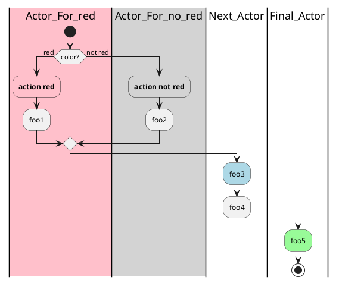

# 業務フロー

## サービス契約 {#service-contract}

```plantuml
@startuml
' !define uml https://raw.githubusercontent.com/flatring/plantuml-stencils/main
' !include uml/colorset/ocean-blue.iuml
' !include uml/colorset/_skinparams.iuml

|#pink|Actor_For_red|
start
if (color?) is (red) then
  #pink:**action red**;
  :foo1;
else (not red)
  |#lightgray|Actor_For_no_red|
  #lightgray:**action not red**;
  :foo2;
endif
|Next_Actor|
#lightblue:foo3;
:foo4;
|Final_Actor|
#palegreen:foo5;
stop
@enduml
```
<!--  -->
<!--  -->
